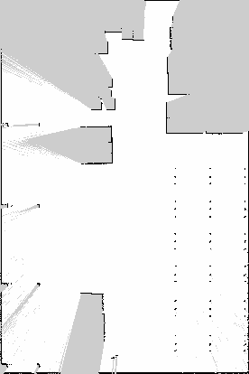

# scout-test

This branch contains configuration and launch files for AgileX Scout, adapted from the [scout_nav2](https://github.com/AIRLab-POLIMI/scout_nav2) repository. It is designed for testing **`slam_toolbox`** and potentially running it on an actual robot.

## Launching Simulation

This beanch contains configuration and launch files for AgileX Scout, taken from [scout_nav2](https://github.com/AIRLab-POLIMI/scout_nav2). I used it to test slam_toolbox and possibly run it on actual robot.

To launch the simulation in Gazebo, use the following commands:

- `ros2 launch agilex_scout simulate_control_gazebo.launch.py lidar_type:=2d rviz:=false`  - launch simulation in gazebo
- `ros2 launch scout_nav2 nav2.launch.py simulation:=true slam:=true localization:=slam_toolbox `- launch slam toolbox
- `ros2 run teleop_twist_key board teleop_twist_keyboard`  - for controlling the robot
-  `ros2 run nav2_map_server map_saver_cli -f newmap` - for saving map

